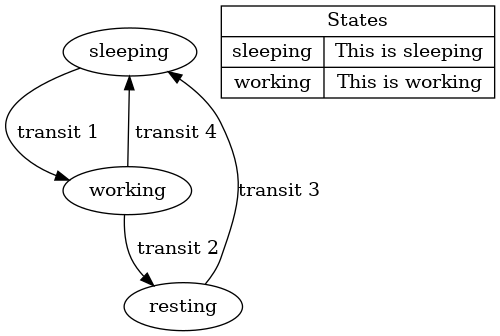

# sv-docgen

## 1. 目的 

提供一个可执行程序，目的在于对verilog源文件进行处理，并生成代码文档。 

## 2. 功能定义 

### 2.1. 软件接口： 

```verilog-docgen a.v b.v c.lst --output out.md [--other-options] ```

### 2.2. Verilog语法 

其中，verilog语法兼容verilog2005，并支持部分sv语法。本文档主要规定了其注释中，满足以下格式的内容： 
```
/** 
  * @command: xxx 
  */ 
  ```

注：除了开始的/**和最后的*/以外，中间的*是可选的。@command为命令，不同命令可能有不同的语法，命令后的:也是可选的。 

对于只有一行的docgen注释，支持以下格式： 

```// @command: xxx ```

当docgen注释处于特定上下文时，将会具有特定意义，如下： 

### 2.2.1. Module注释 

当docgen注释位于module语句前时，该注释称为module注释。其支持以下语法： 
```
/** 
  * @brief this is the foo module 
  * @port din1: this is a port 
  * @param P1: this is a parameter 
  * @param P2: this is another parameter 
  */  
module foo #(parameter P1) (din1); 
    input din1; 
    parameter P2=1; 
endmodule 
```
docgen将会同时从module定义以及注释中提取信息，从而形成文档内容。例如以上示例，docgen应收集以下信息： 

* 模块名为foo 
* 模块说明为this is the foo module 
* 端口din1的方向为input, 类型为wire，宽度为[0:0]，描述为this is a port 
* 参数P1默认值为空，描述为this is a parameter 
* 参数P2默认值为1，描述为this is another parameter 

考虑到部分模块具有非常多的参数或端口，模块注释还提供另一种语法： 
```
/** 
  * @brief this is the foo module 
  */  
module foo #( 
    parameter P1,  //* this is a parameter 
    parameter P2   //* this is another parameter 
) ( 
    input din1,    //* this is an input port 
    output dout1,  //* this is an output port 
); 
endmodule 
```

  

### 2.2.2. Function/Task注释 

当docgen注释位于function/task语句前时，该注释分别为function/task注释。其支持以下语法： 
```
/** 
  * @brief this is the foo function 
  * @port din1: this is a port 
  * @param P1: this is a parameter 
  * @returns: this is the return value 
  */  
function [7:0] foo; 
    input [7:0] din1; 
    parameter P1=1; 
endfunction 
```

docgen将会同时从function/task定义以及注释中提取信息，从而形成文档内容。例如以上示例，docgen应收集以下信息： 
* function名为foo 
* function说明为this is the foo function 
* 端口din1的方向为input, 类型为wire，宽度为[7:0]，描述为this is a port 
* 参数P1默认值为1，描述为this is a parameter 
* function返回值宽度为[7:0]，说明为this is the return value 


### 2.2.3. 信号注释 

当docgen注释位于信号定义前时，该注释为信号注释。其支持以下语法： 
```
/** 
  * @brief this is the foo signal 
  */  
logic [7:0] memory [0:7]; 

// @brief this is the bar register 
reg bar; 
```

docgen将会同时从信号定义以及注释中提取信息，从而形成文档内容。例如以上示例，docgen应收集以下信息： 
* 信号memory宽度为[7:0]，长度为[0:7]，类型为logic，说明为this is the foo signal 
* 信号bar宽度为[0:0]，长度为空，类型为reg，说明为this is the bar register 

### 2.2.4. 状态机注释 

状态机注释无需特定上下文，只需要注释中出现命令@fsm。其支持以下语法： 
```
/** 
  * @fsm: some state machine 
  * @state1: the first state 
  * @state1 -> state2: trigger from state1 to state2 
  * @state2: the second state 
  * @state2 -> state1: trigger from state2 to state1 
  * @state2 -> state3: trigger from state2 to state3 
  * @state3: the third state 
  * @state3 -> state1: trigger from state3 to state1 
  */ 
```
该docgen将使用graphivz工具产生如下状态机的图片： 


 
### 2.2.5. 文件注释 

文件注释无需上下文，只要一个docgen注释不属于上述任何类别即为文件注释。该注释用于描述整个文件。 
```
/** 
  * @file: xx.v 
  * @brief: this is the xx file 
  * @author: yy 
  * @rev 1.0: first version 
  * @rev 2.0: second version 
  */ 
```

### 2.2.6. 通用命令 

部分命令可以在上述所有docgen注释中使用，包括： 
```
/** 
  * @note: some notes 
  * @ref: some reference 
  * @see: see other doc/link 
  * @example: 
  *    some example code 
  * @wave:  
  *   {signal: [ 
  *     {name: 'clk', wave: 'p.....|...'}, 
  *     {name: 'dat', wave: 'x.345x|=.x'}, 
  *   ]} 
  */ 
```
注：@wave会使用wavedrom-editor工具产生波形图片 


 

## 2.3. 输出格式 
### 2.3.1. Markdown输出 

因为markdown具有简单易懂、纯文本化、兼容性好等优点，适合作为一种中间输出，并进一步被doxygen等其他工具进一步处理为网页或pdf等格式。因此verilog-docgen工具目前有限使用markdown作为输出格式。 

输出内容包括：TBD 

### 2.3.2. 错误输出 

当编译器遇到错误时，应在标准输出给出warning及error，包括而不限于：Verilog语法不正确、docgen注释语法不正确、docgen注释与verilog代码不匹配等。 
