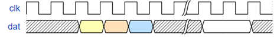

# sv-docgen

## 1. What's this?

sv-docgen is a program that generates documentation from system-verilog source code, similar to doxygen.

[中文文档](README_cn.md)

## 2. Quick start

### 2.1. Command-line

```verilog-docgen a.v b.v c.lst --output out.md [--other-options] ```

To produce [this example](example/test.md), run: 
``` cargo run example/test.sv --output example/test.md --wavedrom=wavedrom-cli --graphviz=dot ```

### 2.2. Verilog comments

The sv-docgen is based on great [sv-parser](https://github.com/dalance/sv-parser), and it supports up to IEEE 1800-2017.
The sv-docgen extends its syntax with some special comments, similar to:

```
/** 
  * @command: xxx 
  */ 
  ```

Note that expect for the begining `/**` and ending `*/`, other `*` is optional.
`@command` is a command, which syntax may vary between different commands. the `:` after command is optional.

When docgen comments appears in some contexts, it will become specialized documentation, as listed below:

### 2.2.1. Module documentation

When docgen comments is placed before a module declaration, it will become a module documentation.
```
/** 
  * @brief this is the foo module 
  * @port din1: this is a port 
  * @param P1: this is a parameter 
  * @param P2: this is another parameter 
  */  
module foo #(P1) (din1); 
    input din1; 
    parameter P2=1; 
endmodule 
```

Considering module can have a lot of ports, following syntax is supported:
```
/** 
  * @brief this is the foo module 
  */  
module foo #( 
    P1,  //* this is a parameter 
    P2   //* this is another parameter 
) ( 
    input din1,    //* this is an input port 
    output dout1,  //* this is an output port 
); 
endmodule 
```


### 2.2.2. Function/Task documentation

When docgen comments is placed before a function/task declaration, it will become a function/task documentation.
```
/** 
  * @brief this is the foo function 
  * @port din1: this is a port 
  * @param P1: this is a parameter 
  * @returns: this is the return value 
  */  
function [7:0] foo; 
    input [7:0] din1; 
    parameter P1=1; 
endfunction 
```

### 2.2.3. Signal documentation 

When docgen comments is placed before a signal declaration, it will become a signal documentation.
```
/** 
  * @brief this is the foo signal 
  */  
logic [7:0] memory [0:7]; 

// @brief this is the bar register 
reg bar; 
```

### 2.2.5. File documentation

if a docgen comment begins with command @file, it is a file documentation.
```
/** 
  * @file: xx.v 
  * @brief: this is the xx file 
  * @author: yy 
  * @rev 1.0: first version 
  * @rev 2.0: second version 
  */ 
```

### 2.2.6. Common commands 

Some commands are available in all above documentations, including: 
```
/** 
  * @note: some notes 
  * @ref: some reference 
  * @see: see other doc/link 
  * @example: 
  *    some example code 
  * @wave:  
  *   {signal: [ 
  *     {name: 'clk', wave: 'p.....|...'}, 
  *     {name: 'dat', wave: 'x.345x|=.x'}, 
  *   ]} 
  */ 
```
Note: @wave will use wavedrom-cli to generate wave image 
To install wavedrom-cli, you can use `num install -g wavedrom_cli` or download manually.
To let docgen make use of graphviz, you should add `--wavedrom=wavedrom_cli`


 

State machine documentation are also supported, see below:
```
/** 
  * @fsm SomeStateMachine
  * @state sleeping: This is sleeping
  * @state working: This is working
  * @sleeping->working: transit 1
  * @working->resting: transit 2
  * @resting -> sleeping transit 3
  * @working->sleeping: transit 4
  */ 
```
Note: @fsm will use graphivz to generate state machine image. 
To install graphviz, you can use `apt-get install graphivz` or download manually.
To let docgen make use of graphviz, you should add `--graphviz=dot`


 

## 2.3. Output

The docgen currently supports output as Markdown. See [example](exapmle/test.md).