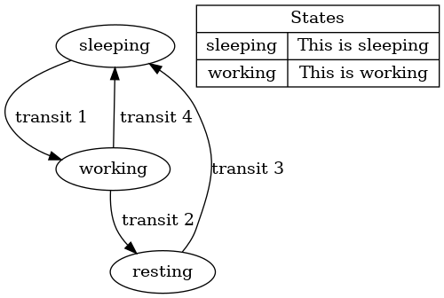

# 1. File test.sv

## 1.1. module test

### 1.1.1. Parameters

| name | default | type | dimensions | brief |
| ---- | ------- | ---- | ---------- | ----- |
| A | 1 |  |  | this is A |
| B | "2" |  |  |  |
| C |  |  |  |  |

### 1.1.2. Ports

| name | direction | type | dimensions | brief |
| ---- | --------- | ---- | ---------- | ----- |
| a | input | wire[9:0] | [0:4] |  |
| b |  |  |  |  this is port b |
| c | inout |  |  |  |

## 1.1. module test2

this is test2

> **Note:**
>
> some notes
>
> more notes
>
> and more notes
>

**Author:** huikan

**Example:** 
```

assign a = b;
test2 u_test(a,b,c);
```

**Waveform:** 

 

**State Machine:** SomeStateMachine
 

### 1.1.1. Parameters

| name | default | type | dimensions | brief |
| ---- | ------- | ---- | ---------- | ----- |
| A | 0 |  | [0:5] | this is A |
| B |  | int |  | this is B  |
| C |  |  |  |  this is C |

### 1.1.2. Ports

| name | direction | type | dimensions | brief |
| ---- | --------- | ---- | ---------- | ----- |
| a | input |  |  | this is port a |
| c | input |  |  |  |
| b | input | logic[A:0] | [3:0] |  this is port b |

## 1.1. module test3

